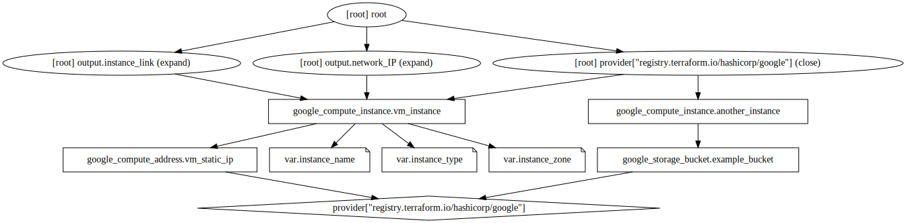

## terraform commands
```
terraform fmt
terraform init
terraform plan
terraform apply
terraform output
```

## running terraform with variables
```
# .tfvars file (recommended method)
terraform apply -var-file terraform.tfvars

# CLI options
terraform apply -var instance_name="myinstance-cli"

# env variables
export TF_VAR_instance_name="myinstance-env" && terraform apply

# using terraform.tfvars
terraform apply
```

## variable validation
```
# try to see the error
terraform apply -var instance_zone="us-west1-a"
```

## Files
```
provider.tf
instance.tf - resource definition
variables.tf - variables definition
outputs.tf - outputs definition
terraform.tfvars - variable values
exp.tf - explicit dependencies
```

## Dependency Graph
```
terraform graph | dot -Tsvg > graph.svg
```


## Other resources
- https://registry.terraform.io/
- Cloud Foundation Toolkit (CFT) - CFT module allows you to maintain the IAM roles for multiple projects within the same module.