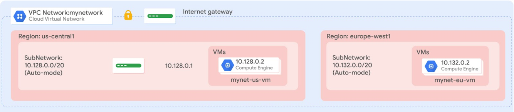

https://developer.hashicorp.com/terraform/tutorials/gcp-get-started

```
$terraform --version
Terraform v1.5.6
on linux_amd64
```
```
$cd tfinfra
$terraform init

Initializing the backend...

Initializing provider plugins...
- Finding latest version of hashicorp/google...
- Installing hashicorp/google v4.83.0...
- Installed hashicorp/google v4.83.0 (signed by HashiCorp)

Terraform has created a lock file .terraform.lock.hcl to record the provider
selections it made above. Include this file in your version control repository
so that Terraform can guarantee to make the same selections by default when
you run "terraform init" in the future.

Terraform has been successfully initialized!

You may now begin working with Terraform. Try running "terraform plan" to see
any changes that are required for your infrastructure. All Terraform commands
should now work.

If you ever set or change modules or backend configuration for Terraform,
rerun this command to reinitialize your working directory. If you forget, other
commands will detect it and remind you to do so if necessary.
```

```
$terraform init

Initializing the backend...
Initializing modules...
- mynet-eu-vm in instance
- mynet-us-vm in instance

Initializing provider plugins...
- Reusing previous version of hashicorp/google from the dependency lock file
- Using previously-installed hashicorp/google v4.83.0

Terraform has been successfully initialized!

You may now begin working with Terraform. Try running "terraform plan" to see
any changes that are required for your infrastructure. All Terraform commands
should now work.

If you ever set or change modules or backend configuration for Terraform,
rerun this command to reinitialize your working directory. If you forget, other
commands will detect it and remind you to do so if necessary.
```


```
$ terraform plan

Terraform used the selected providers to generate the following execution plan. Resource actions are indicated with the following symbols:
  + create

Terraform will perform the following actions:

  # google_compute_firewall.mynetwork-allow-http-ssh-rdp-icmp will be created
  + resource "google_compute_firewall" "mynetwork-allow-http-ssh-rdp-icmp" {
      + creation_timestamp = (known after apply)
      + destination_ranges = (known after apply)
      + direction          = (known after apply)
      + enable_logging     = (known after apply)
      + id                 = (known after apply)
      + name               = "mynetwork-allow-http-ssh-rdp-icmp"
      + network            = (known after apply)
      + priority           = 1000
      + project            = (known after apply)
      + self_link          = (known after apply)
      + source_ranges      = [
          + "0.0.0.0/0",
        ]

      + allow {
          + ports    = [
              + "22",
              + "80",
              + "3389",
            ]
          + protocol = "tcp"
        }
      + allow {
          + ports    = []
          + protocol = "icmp"
        }
    }

  # google_compute_network.mynetwork will be created
  + resource "google_compute_network" "mynetwork" {
      + auto_create_subnetworks                   = true
      + delete_default_routes_on_create           = false
      + gateway_ipv4                              = (known after apply)
      + id                                        = (known after apply)
      + internal_ipv6_range                       = (known after apply)
      + mtu                                       = (known after apply)
      + name                                      = "mynetwork"
      + network_firewall_policy_enforcement_order = "AFTER_CLASSIC_FIREWALL"
      + project                                   = (known after apply)
      + routing_mode                              = (known after apply)
      + self_link                                 = (known after apply)
    }

  # module.mynet-eu-vm.google_compute_instance.vm_instance will be created
  + resource "google_compute_instance" "vm_instance" {
      + can_ip_forward       = false
      + cpu_platform         = (known after apply)
      + current_status       = (known after apply)
      + deletion_protection  = false
      + guest_accelerator    = (known after apply)
      + id                   = (known after apply)
      + instance_id          = (known after apply)
      + label_fingerprint    = (known after apply)
      + machine_type         = "e2-micro"
      + metadata_fingerprint = (known after apply)
      + min_cpu_platform     = (known after apply)
      + name                 = "mynet-eu-vm"
      + project              = (known after apply)
      + self_link            = (known after apply)
      + tags_fingerprint     = (known after apply)
      + zone                 = "europe-west1-d"

      + boot_disk {
          + auto_delete                = true
          + device_name                = (known after apply)
          + disk_encryption_key_sha256 = (known after apply)
          + kms_key_self_link          = (known after apply)
          + mode                       = "READ_WRITE"
          + source                     = (known after apply)

          + initialize_params {
              + image  = "debian-cloud/debian-11"
              + labels = (known after apply)
              + size   = (known after apply)
              + type   = (known after apply)
            }
        }

      + network_interface {
          + internal_ipv6_prefix_length = (known after apply)
          + ipv6_access_type            = (known after apply)
          + ipv6_address                = (known after apply)
          + name                        = (known after apply)
          + network                     = (known after apply)
          + network_ip                  = (known after apply)
          + stack_type                  = (known after apply)
          + subnetwork                  = (known after apply)
          + subnetwork_project          = (known after apply)

          + access_config {
              + nat_ip       = (known after apply)
              + network_tier = (known after apply)
            }
        }
    }

  # module.mynet-us-vm.google_compute_instance.vm_instance will be created
  + resource "google_compute_instance" "vm_instance" {
      + can_ip_forward       = false
      + cpu_platform         = (known after apply)
      + current_status       = (known after apply)
      + deletion_protection  = false
      + guest_accelerator    = (known after apply)
      + id                   = (known after apply)
      + instance_id          = (known after apply)
      + label_fingerprint    = (known after apply)
      + machine_type         = "e2-micro"
      + metadata_fingerprint = (known after apply)
      + min_cpu_platform     = (known after apply)
      + name                 = "mynet-us-vm"
      + project              = (known after apply)
      + self_link            = (known after apply)
      + tags_fingerprint     = (known after apply)
      + zone                 = "us-central1-b"

      + boot_disk {
          + auto_delete                = true
          + device_name                = (known after apply)
          + disk_encryption_key_sha256 = (known after apply)
          + kms_key_self_link          = (known after apply)
          + mode                       = "READ_WRITE"
          + source                     = (known after apply)

          + initialize_params {
              + image  = "debian-cloud/debian-11"
              + labels = (known after apply)
              + size   = (known after apply)
              + type   = (known after apply)
            }
        }

      + network_interface {
          + internal_ipv6_prefix_length = (known after apply)
          + ipv6_access_type            = (known after apply)
          + ipv6_address                = (known after apply)
          + name                        = (known after apply)
          + network                     = (known after apply)
          + network_ip                  = (known after apply)
          + stack_type                  = (known after apply)
          + subnetwork                  = (known after apply)
          + subnetwork_project          = (known after apply)

          + access_config {
              + nat_ip       = (known after apply)
              + network_tier = (known after apply)
            }
        }
    }

Plan: 4 to add, 0 to change, 0 to destroy.

──────────────────────────────────────────────────────────────────────────────────────────────────────────────────────────────────────────────────────────

Note: You didn't use the -out option to save this plan, so Terraform can't guarantee to take exactly these actions if you run "terraform apply" now.
```


```
$ terraform apply

Terraform used the selected providers to generate the following execution plan. Resource actions are indicated with the following symbols:
  + create

Terraform will perform the following actions:

  # google_compute_firewall.mynetwork-allow-http-ssh-rdp-icmp will be created
  + resource "google_compute_firewall" "mynetwork-allow-http-ssh-rdp-icmp" {
      + creation_timestamp = (known after apply)
      + destination_ranges = (known after apply)
      + direction          = (known after apply)
      + enable_logging     = (known after apply)
      + id                 = (known after apply)
      + name               = "mynetwork-allow-http-ssh-rdp-icmp"
      + network            = (known after apply)
      + priority           = 1000
      + project            = (known after apply)
      + self_link          = (known after apply)
      + source_ranges      = [
          + "0.0.0.0/0",
        ]

      + allow {
          + ports    = [
              + "22",
              + "80",
              + "3389",
            ]
          + protocol = "tcp"
        }
      + allow {
          + ports    = []
          + protocol = "icmp"
        }
    }

  # google_compute_network.mynetwork will be created
  + resource "google_compute_network" "mynetwork" {
      + auto_create_subnetworks                   = true
      + delete_default_routes_on_create           = false
      + gateway_ipv4                              = (known after apply)
      + id                                        = (known after apply)
      + internal_ipv6_range                       = (known after apply)
      + mtu                                       = (known after apply)
      + name                                      = "mynetwork"
      + network_firewall_policy_enforcement_order = "AFTER_CLASSIC_FIREWALL"
      + project                                   = (known after apply)
      + routing_mode                              = (known after apply)
      + self_link                                 = (known after apply)
    }

  # module.mynet-eu-vm.google_compute_instance.vm_instance will be created
  + resource "google_compute_instance" "vm_instance" {
      + can_ip_forward       = false
      + cpu_platform         = (known after apply)
      + current_status       = (known after apply)
      + deletion_protection  = false
      + guest_accelerator    = (known after apply)
      + id                   = (known after apply)
      + instance_id          = (known after apply)
      + label_fingerprint    = (known after apply)
      + machine_type         = "e2-micro"
      + metadata_fingerprint = (known after apply)
      + min_cpu_platform     = (known after apply)
      + name                 = "mynet-eu-vm"
      + project              = (known after apply)
      + self_link            = (known after apply)
      + tags_fingerprint     = (known after apply)
      + zone                 = "europe-west1-d"

      + boot_disk {
          + auto_delete                = true
          + device_name                = (known after apply)
          + disk_encryption_key_sha256 = (known after apply)
          + kms_key_self_link          = (known after apply)
          + mode                       = "READ_WRITE"
          + source                     = (known after apply)

          + initialize_params {
              + image  = "debian-cloud/debian-11"
              + labels = (known after apply)
              + size   = (known after apply)
              + type   = (known after apply)
            }
        }

      + network_interface {
          + internal_ipv6_prefix_length = (known after apply)
          + ipv6_access_type            = (known after apply)
          + ipv6_address                = (known after apply)
          + name                        = (known after apply)
          + network                     = (known after apply)
          + network_ip                  = (known after apply)
          + stack_type                  = (known after apply)
          + subnetwork                  = (known after apply)
          + subnetwork_project          = (known after apply)

          + access_config {
              + nat_ip       = (known after apply)
              + network_tier = (known after apply)
            }
        }
    }

  # module.mynet-us-vm.google_compute_instance.vm_instance will be created
  + resource "google_compute_instance" "vm_instance" {
      + can_ip_forward       = false
      + cpu_platform         = (known after apply)
      + current_status       = (known after apply)
      + deletion_protection  = false
      + guest_accelerator    = (known after apply)
      + id                   = (known after apply)
      + instance_id          = (known after apply)
      + label_fingerprint    = (known after apply)
      + machine_type         = "e2-micro"
      + metadata_fingerprint = (known after apply)
      + min_cpu_platform     = (known after apply)
      + name                 = "mynet-us-vm"
      + project              = (known after apply)
      + self_link            = (known after apply)
      + tags_fingerprint     = (known after apply)
      + zone                 = "us-central1-b"

      + boot_disk {
          + auto_delete                = true
          + device_name                = (known after apply)
          + disk_encryption_key_sha256 = (known after apply)
          + kms_key_self_link          = (known after apply)
          + mode                       = "READ_WRITE"
          + source                     = (known after apply)

          + initialize_params {
              + image  = "debian-cloud/debian-11"
              + labels = (known after apply)
              + size   = (known after apply)
              + type   = (known after apply)
            }
        }

      + network_interface {
          + internal_ipv6_prefix_length = (known after apply)
          + ipv6_access_type            = (known after apply)
          + ipv6_address                = (known after apply)
          + name                        = (known after apply)
          + network                     = (known after apply)
          + network_ip                  = (known after apply)
          + stack_type                  = (known after apply)
          + subnetwork                  = (known after apply)
          + subnetwork_project          = (known after apply)

          + access_config {
              + nat_ip       = (known after apply)
              + network_tier = (known after apply)
            }
        }
    }

Plan: 4 to add, 0 to change, 0 to destroy.

Do you want to perform these actions?
  Terraform will perform the actions described above.
  Only 'yes' will be accepted to approve.

  Enter a value: yes

google_compute_network.mynetwork: Creating...
google_compute_network.mynetwork: Still creating... [10s elapsed]
google_compute_network.mynetwork: Still creating... [20s elapsed]
google_compute_network.mynetwork: Still creating... [30s elapsed]
google_compute_network.mynetwork: Still creating... [40s elapsed]
google_compute_network.mynetwork: Creation complete after 43s [id=projects/qwiklabs-gcp-01-d7c371fe8a5c/global/networks/mynetwork]
google_compute_firewall.mynetwork-allow-http-ssh-rdp-icmp: Creating...
module.mynet-eu-vm.google_compute_instance.vm_instance: Creating...
module.mynet-us-vm.google_compute_instance.vm_instance: Creating...
google_compute_firewall.mynetwork-allow-http-ssh-rdp-icmp: Still creating... [10s elapsed]
module.mynet-eu-vm.google_compute_instance.vm_instance: Still creating... [10s elapsed]
module.mynet-us-vm.google_compute_instance.vm_instance: Still creating... [10s elapsed]
google_compute_firewall.mynetwork-allow-http-ssh-rdp-icmp: Creation complete after 11s [id=projects/qwiklabs-gcp-01-d7c371fe8a5c/global/firewalls/mynetwork-allow-http-ssh-rdp-icmp]
module.mynet-eu-vm.google_compute_instance.vm_instance: Creation complete after 14s [id=projects/qwiklabs-gcp-01-d7c371fe8a5c/zones/europe-west1-d/instances/mynet-eu-vm]
module.mynet-us-vm.google_compute_instance.vm_instance: Creation complete after 15s [id=projects/qwiklabs-gcp-01-d7c371fe8a5c/zones/us-central1-b/instances/mynet-us-vm]

Apply complete! Resources: 4 added, 0 changed, 0 destroyed.
```


```
student-02-33b2afe16e89@mynet-eu-vm:~$ ping -c 3 10.128.0.2
PING 10.128.0.2 (10.128.0.2) 56(84) bytes of data.
64 bytes from 10.128.0.2: icmp_seq=1 ttl=64 time=104 ms
64 bytes from 10.128.0.2: icmp_seq=2 ttl=64 time=103 ms
64 bytes from 10.128.0.2: icmp_seq=3 ttl=64 time=103 ms

--- 10.128.0.2 ping statistics ---
3 packets transmitted, 3 received, 0% packet loss, time 2003ms
rtt min/avg/max/mdev = 102.828/103.212/103.938/0.513 ms
student-02-33b2afe16e89@mynet-eu-vm:~$ ping -c 3 34.22.130.222
PING 34.22.130.222 (34.22.130.222) 56(84) bytes of data.
64 bytes from 34.22.130.222: icmp_seq=1 ttl=61 time=1.05 ms
64 bytes from 34.22.130.222: icmp_seq=2 ttl=61 time=0.516 ms
64 bytes from 34.22.130.222: icmp_seq=3 ttl=61 time=0.552 ms

--- 34.22.130.222 ping statistics ---
3 packets transmitted, 3 received, 0% packet loss, time 2017ms
rtt min/avg/max/mdev = 0.516/0.707/1.054/0.245 ms
student-02-33b2afe16e89@mynet-eu-vm:~$ ping -c 3 104.198.68.125
PING 104.198.68.125 (104.198.68.125) 56(84) bytes of data.
64 bytes from 104.198.68.125: icmp_seq=1 ttl=54 time=105 ms
64 bytes from 104.198.68.125: icmp_seq=2 ttl=54 time=103 ms
64 bytes from 104.198.68.125: icmp_seq=3 ttl=54 time=103 ms

--- 104.198.68.125 ping statistics ---
3 packets transmitted, 3 received, 0% packet loss, time 2003ms
rtt min/avg/max/mdev = 103.274/103.711/104.542/0.587 ms
student-02-33b2afe16e89@mynet-eu-vm:~$ ping -c 3 10.132.0.2
PING 10.132.0.2 (10.132.0.2) 56(84) bytes of data.
64 bytes from 10.132.0.2: icmp_seq=1 ttl=64 time=0.034 ms
64 bytes from 10.132.0.2: icmp_seq=2 ttl=64 time=0.058 ms
64 bytes from 10.132.0.2: icmp_seq=3 ttl=64 time=0.055 ms

--- 10.132.0.2 ping statistics ---
3 packets transmitted, 3 received, 0% packet loss, time 2028ms
rtt min/avg/max/mdev = 0.034/0.049/0.058/0.010 ms
```

## Dependency Graph
```
terraform graph | dot -Tsvg > graph.svg
```


